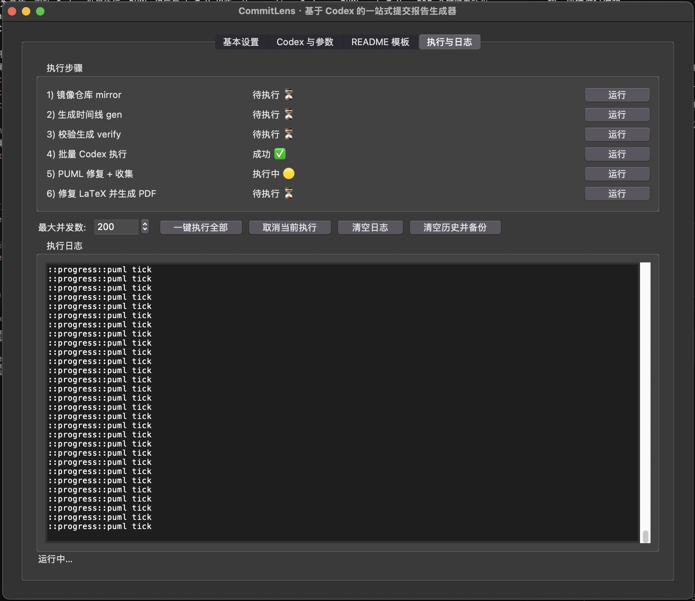
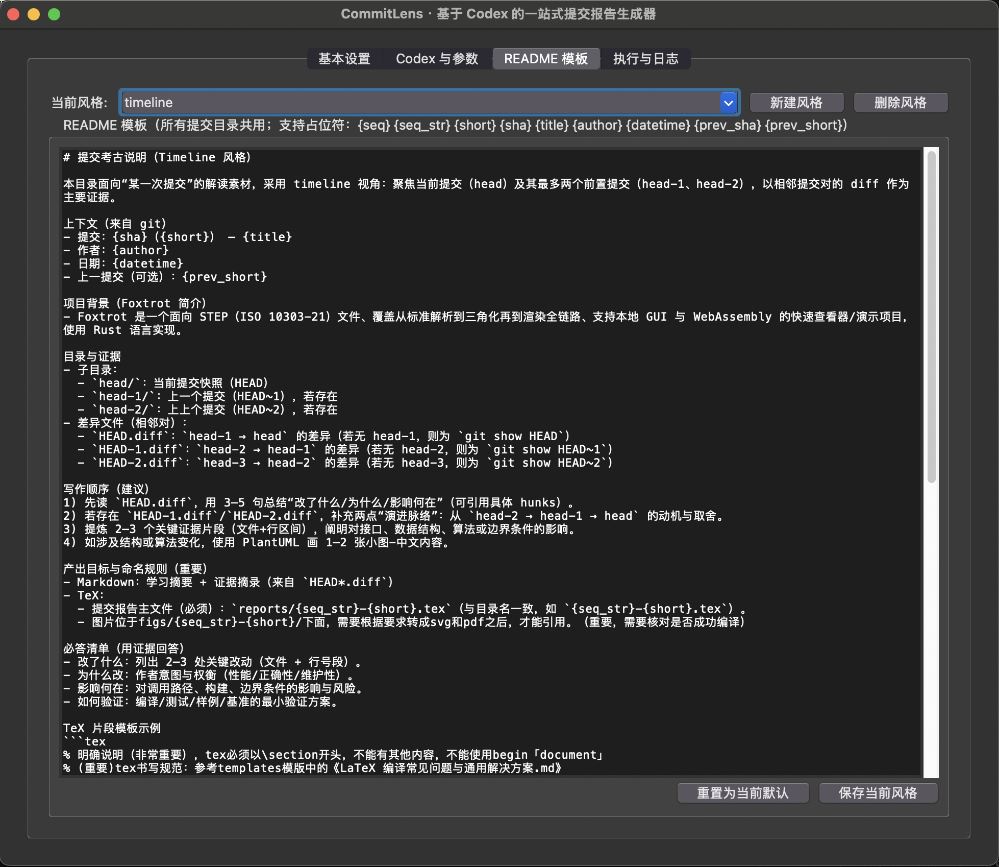

CommitLens · 基于 Codex 的一站式提交报告生成器（timeline sboxes + Codex + PUML + LaTeX）

**快速预览生成效果（PDF）**：查看示例输出 → [Example.pdf](./Example.pdf)

界面预览：



设置面板（参数与风格）：




概述
- 一句话：以提交为单位，驱动 Codex 批量执行、PUML 修复与 LaTeX 组版，从 commit → Codex → PUML → LaTeX → PDF 全链路自动化。
- 风格：timeline（每个提交包含 head/head-1/head-2 的检出与相邻 diff），内置 README 学习提示与《计算几何教材.md》，并附参考模板。
- 可追踪：所有 Codex 子任务均采用“queued → running → 退出码”的状态机制，输出流式写入到 txt，支持断点续跑与并发。

流式输出与状态机制（强烈建议配合 tail 实时查看）
- 批量 Codex（第 4 步）：每个提交目录写入三份文件（先创建为 queued，执行中实时追加，结束写入退出码）
  - `.sboxes/<NNN>-<short>/codex_output.txt`
  - `.sboxes/<NNN>-<short>/codex_error.txt`
  - `.sboxes/<NNN>-<short>/codex_status.txt`（`queued → running → 0/124/非0`）
- PUML 修复（第 5 步）：写入到每个图示目录 `figs/<NNN>-<short>/` 下
  - `codex_puml_output.txt`、`codex_puml_error.txt`、`codex_puml_status.txt`
- LaTeX 修复（第 6 步）：写入到产物根目录 `.artifacts/`
  - `codex_fix_output.txt`、`codex_fix_error.txt`、`codex_fix_status.txt`

快速查看示例
```bash
# 追踪某个提交在第 4 步的实时输出：
tail -f .sboxes/004-xxxxxxx/codex_output.txt

# 统计第 4 步尚在排队/执行中的数量：
rg -n "^(queued|running)$" -S .sboxes/*/codex_status.txt | wc -l

# 列出第 4 步非 0 退出码（失败/超时=124）：
rg -n "^(?!0$).+" -S .sboxes/*/codex_status.txt

# 追踪第 5 步（PUML）实时输出：
tail -f .sboxes/004-xxxxxxx/figs/004-xxxxxxx/codex_puml_output.txt

# 追踪第 6 步（LaTeX）实时输出：
tail -f .artifacts/codex_fix_output.txt
```

断点续跑与强制重跑
- 第 4/5 步默认自动跳过已成功（status 为 `0/OK/SUCCESS`）的项，仅重试失败/超时/缺失状态的目录。
- 需要强制重跑：优先使用 CLI 的 `--force` 参数（更安全、可控）；等价方式是手工删除对应目录的 `status` 文件（保留 `output` 以追踪历史）。
  - 第 4 步：`commitlens codex batch --root ... --force`（删除 `codex_status.txt`、`codex_error.txt`，保留 `codex_output.txt`）
  - 第 5 步：`commitlens codex puml --root ... --force`（删除 `codex_puml_status.txt`、`codex_puml_error.txt`，保留 `codex_puml_output.txt`）
  - 第 6 步：`commitlens fixbug ... --runs N --force`（每次运行前删除 `codex_fix_status.txt`、`codex_fix_error.txt`，保留并追加写入 `codex_fix_output.txt`）

编码鲁棒性
- 所有子进程输出以 `UTF-8 + errors=replace` 解码，保证实时日志不会因个别非 UTF‑8 字节中断（会显示为替代符）。

核心命令（命令名支持 `commitlens` 与 `sboxgen`）
- 镜像与列提交：
  - `commitlens mirror --repo <URL|PATH> --dest .cache/mirrors/repo.git`
  - `commitlens list --mirror .cache/mirrors/repo.git --branch master --limit 5`
- 生成时间线（timeline）：
  - `commitlens gen --mirror .cache/mirrors/repo.git --branch master --out .sboxes --limit 10 --overwrite --style timeline`
- 校验结果：
  - `commitlens verify --root .sboxes --strict`
- 模板管理：
  - `commitlens template list`
  - `commitlens template copy --name extended --to .sboxes/003-xxxxxxx --overwrite`
  - `commitlens template copy-all --name basic --root .sboxes --overwrite`
- 批量执行与收集（可选）：
 - `commitlens run --root .sboxes --collect-root .artifacts --collect-figs`
- Codex 执行（单个/批量）：
  - `commitlens codex one --dir .sboxes/001-xxxxxxx --timeout 600`
  - `commitlens codex batch --root .sboxes --limit 10 --timeout 600 [--runs N] [--force]`
  - `commitlens codex puml --root .sboxes --limit 10 --timeout 600 [--runs N] [--force]`

Codex 密钥
- 获取顺序：命令行 `--api-key` > 环境变量 `CODEX_API_KEY` > 文件 `.cache/codex_api_key`（已在 .gitignore 中忽略）。
- 示例：`echo "sk-..." > .cache/codex_api_key` 后可直接使用 `commitlens codex ...`。

时间线目录结构（每个提交 NNN-<short>/）
- head/：当前提交检出；head-1/、head-2/（若存在）
- HEAD.diff：head-1 → head（首提交为 git show）
- HEAD-1.diff / HEAD-2.diff：相邻历史的差异（缺历史时使用 git show）
- README.md：学习提示（写作顺序/必答清单/图示指南）；项目背景简述
- 计算几何教材.md：随目录复制的学习资料
- template/：参考模板（basic/extended），包含 PUML 与 TeX 片段与导图脚本

图示导出（推荐流程）
1) 先生成 SVG：`plantuml -tsvg -o . figs/*.puml`
2) 将 SVG 转为 PDF：
   - librsvg：`for s in figs/*.svg; do rsvg-convert -f pdf -o "${s%.svg}.pdf" "$s"; done`
   - macOS：`for s in figs/*.svg; do sips -s format pdf "$s" --out "${s%.svg}.pdf"; done`
3) 在 TeX 片段中引用 PDF 图示。

规范化示例流程（以 foxtrot 项目为例）：

0) 激活虚拟环境，并配置 Codex API 密钥  
   ```bash
   source .venv/bin/activate
   echo "sk-..." > .cache/codex_api_key
   ```

1) 镜像仓库  
   ```bash
   commitlens mirror --repo https://github.com/Formlabs/foxtrot.git --dest .cache/mirrors/foxtrot.git
   ```

2) 生成时间线目录  
   ```bash
   commitlens gen --mirror .cache/mirrors/foxtrot.git --branch master --out .sboxes --limit 10 --overwrite --style timeline
   ```

3) 校验生成结果  
   ```bash
   commitlens verify --root .sboxes --strict
   ```

4) 批量运行 Codex 生成解读（默认断点续跑；可用 --runs N 重复执行；如需强制重跑加 --force）  
   ```bash
   commitlens codex batch --root .sboxes --limit 10 --timeout 6000
   # 连续执行 3 次（逐次断点续跑）：
   commitlens codex batch --root .sboxes --limit 10 --timeout 6000 --runs 3
   # 强制重跑（删除 status+error，保留 output）：
   commitlens codex batch --root .sboxes --limit 10 --timeout 6000 --force
   ```

5) PUML 修复 + 收集（默认断点续跑；可用 --runs N 重复执行；如需强制重跑加 --force）  
   ```bash
   # 先修复 PUML（仅对包含 figs/**/algorithm_flow.puml 的目录）
   commitlens codex puml --root .sboxes --timeout 6000
   # 连续执行 2 次（逐次断点续跑）：
   commitlens codex puml --root .sboxes --timeout 6000 --runs 2
   # 强制重跑 PUML：
   commitlens codex puml --root .sboxes --timeout 6000 --force
   # 再收集图示与报告片段
   commitlens run --root .sboxes --collect-root .artifacts --collect-figs
   ```

6) 并行修复 xelatex（每个提交单独 main-<NNN>-<short>.tex，并行 Codex 修复）  
   ```bash
   # 为 artifacts/reports 中的每个 <NNN>-<short>.tex 生成 main-<NNN>-<short>.tex，并行修复：
   commitlens fixbugs --artifacts .artifacts --runs 3 --timeout 6000 --max-parallel 32
   # 强制模式（每个分片运行前删除 codex_fix_status_<stem>.txt / codex_fix_error_<stem>.txt）：
   commitlens fixbugs --artifacts .artifacts --runs 3 --timeout 6000 --max-parallel 32 --force
   ```

7) 修复 xelatex 编译错误并生成最终 PDF（单主文档 main.tex；运行 N 次，保留 output 续写；可选 --force 每次清理 status/error）  
   ```bash
   commitlens fixbug --artifacts .artifacts --tex main.tex --runs 3 --timeout 6000
   # 强制模式（每次运行前删除 codex_fix_status.txt / codex_fix_error.txt）：
   commitlens fixbug --artifacts .artifacts --tex main.tex --runs 3 --timeout 6000 --force
   ```
   - 等价于通过 Codex 执行：`codex exec --skip-git-repo-check --sandbox workspace-write "请进入到.artifacts，然后执行xelatex main.tex命令，帮我修复输出tex编译错误，最终生成完整的pdf文档，需反复执行3次，确认最终没有bug，可容许有warning"`
   - 默认参数：`--artifacts .artifacts`，`--tex main.tex`，`--runs 3`；支持 `--api-key`、`--dry-run`、`--timeout`、`--no-save`。

8) 回写 .artifacts 到 .sboxes（覆盖 reports 与 figs）  
   ```bash
   # 将 .artifacts 下的 reports/*.tex 与 figs/<NNN-short>/ 写回到对应的时间线提交目录
   commitlens overwrite --artifacts .artifacts --root .sboxes
   # 仅覆盖报告或仅覆盖图示：
   commitlens overwrite --artifacts .artifacts --root .sboxes --no-figs
   commitlens overwrite --artifacts .artifacts --root .sboxes --no-reports
   ```
   - 行为：
    - reports：`.artifacts/reports/<name>.tex` -> `.sboxes/<commit>/reports/<name>.tex`
    - figs：`.artifacts/figs/<commit>/...` 替换 `.sboxes/<commit>/figs/<commit>/...`
     - `<commit>` 默认按目录名精确匹配；若为 `NNN-commit.tex` 也会按数字前缀匹配对应提交目录。

先决条件
- Python 3.9+；git；（可选）PlantUML/Graphviz；（可选）librsvg 或 macOS sips；（可选）Codex CLI 与 API key。

状态与范围
- 当前实现聚焦 timeline 产物、模板与执行编排，不包含任何与业务强绑定的后处理；可按 README 的学习提示进行自定义解读与报告生成。

图形界面（可选）
- 界面预览：见文首“界面预览”两图；启动命令：`python tools/sboxgen_gui.py`
- 核心定位：一键执行/分步执行全流程；多标签分工明确；每步有状态与滚动日志。
- 位置：`tools/sboxgen_gui.py`

标签与功能总览
- `基本设置`：仓库/分支/提交数/风格与各目录（mirror/sboxes/sboxes_tex/artifacts）；可自动推断镜像路径、刷新分支、统计分支提交总数。
- `Codex 与参数`：可视化编辑三类提示词（运行/PUML+LaTeX 并行修复/最终 LaTeX 修复），一键保存到 `.cache`；支持占位符（如 `{dir}` `{tex}` `{runs}`）。
- `README 模板`：按“风格=模板”的思路管理 README 文本；内置默认模板；支持导入/删除/保存，运行时应用到每个提交目录（支持占位符）。
- `执行与日志`：流水线面板（mirror → gen → verify → codex batch → collect-tex → tex-fix → collect+fixbug → overwrite），可一键执行或逐步执行；显示步骤状态与实时日志；支持最大并行、超时等参数。
- `Codex Output`：可浏览/加载/监控某个提交目录下的 `codex_output.txt`；内置简单执行器（直接触发 `codex exec ...`），解析消息（header/user/thinking/codex/exec/separator），并自动高亮、跳转消息。
- `任务执行`：任务列表 + 消息列表 + 右侧日志详情；支持一键执行全量提交、自动追踪最新输出、进度统计、从指定任务 ID 重新开始等；中部嵌入 Graph 预览工具栏已移除，采用新的“commit info”页签统一交互渲染。
- `commit info`：交互式提交图与详情面板（左侧 Canvas 交互图；右侧为提交详情+文件树+Diff/File 视图切换）。点击节点显示标签气泡、自动在任务列表中定位关联任务（若名称匹配），并在右侧加载该提交的文件变更与内容。

交互式提交图（commit info）
- 渲染来源：优先使用 Rust FFI（布局 JSON）；若不可用，自动回退到执行 `git-graph --json`。
- 依赖要求：
  - JSON 路径：推荐在 `.workspace/rust-project` 下准备 `git-graph` 工程（GUI 会优先使用此处构建的可执行文件），或设置环境变量 `SBOXGEN_GIT_GRAPH` 指向系统已安装的 `git-graph`。
  - FFI 路径：可通过 `SBOXGEN_GG_DIR` 指定 `git-graph` 源码目录（默认 `<repo>/src/git-graph`），`SBOXGEN_GG_FFI` 指定动态库路径；若未提供或未构建成功，GUI 会自动降级为 JSON 路径。
- 使用提示：
  - 进入 `commit info` 页签后，点击“交互渲染”；左侧可滚动与缩放（鼠标滚轮/拖拽）；点击节点显示标签气泡并在右侧加载详情；右侧可在 “Diff View / File View” 间切换。
  - 默认仓库路径为 `.workspace/rust-project`（可在“任务执行”页更改 Workspace 与项目名）。

设置项速览（“基本设置”页）
- `Git 仓库 URL`：如 `https://github.com/Formlabs/foxtrot.git`
- `分支`：`master` 或 `main`（支持刷新）；显示“分支提交总数”。
- `提交数 limit`：如 `10`
- `风格 (模板)`：默认 `timeline`；可导入 `.md` 作为新风格；生成结构固定采用 timeline
- `镜像路径 mirror`：默认 `.cache/mirrors/<name>.git`
- `时间线根目录 out`：默认 `.sboxes`
- `TEX 时间线根目录 (收集输出)`：默认 `.sboxes_tex`
- `产物目录 artifacts`：默认 `.artifacts`
- `超时 timeout`/`LaTeX runs`/`OpenAI/Codex API Key` 等

启动与反馈
- 启动：`python tools/sboxgen_gui.py`
- 反馈：每一步均显示状态（待执行/执行中/成功/失败）与滚动日志，可单步执行或“一键执行全部”。

环境变量（可选）
- `SBOXGEN_GIT_GRAPH`：显式指定 `git-graph` 可执行文件路径（优先级最高）。
- `SBOXGEN_GG_DIR`：指定 FFI 源码目录（默认 `<repo>/src/git-graph`）。
- `SBOXGEN_GG_FFI`：指定 FFI 动态库路径（默认 `<SBOXGEN_GG_DIR>/target/release/libgit_graph.{dylib|so|dll}`）。

可编辑 Prompt 与 README（GUI）
- Codex 提示词：在“Codex 与参数”页可直接编辑两类提示词并保存（支持占位符）：
  - 运行提示词：支持 `{dir}`；也可用环境变量/文件覆盖：`SBOXGEN_CODEX_PROMPT` / `SBOXGEN_CODEX_PROMPT_FILE`
  - PUML + LaTeX 并行修复提示词（用于 tex-fix）：支持 `{dir}`、`{tex}`、`{runs}`；支持 `SBOXGEN_CODEX_TEX_FIX_PROMPT` / `SBOXGEN_CODEX_TEX_FIX_PROMPT_FILE`
  - LaTeX 修复提示词（用于最终 fixbug）：支持 `{dir}`、`{tex}`、`{runs}`；支持 `SBOXGEN_CODEX_LATEX_PROMPT` / `SBOXGEN_CODEX_LATEX_PROMPT_FILE`（GUI 同时会填充 `SBOXGEN_CODEX_LATEX_SHARDS_PROMPT` 以兼容实现）
- README 模板（风格=模板）：
  - 在“README 模板”页编辑当前风格的模板；默认风格为 `timeline`，打开即有默认内容
  - 在“基本设置”可刷新/导入 `.md` 模板并选择风格；导入后保存至 `.cache/styles/<style>.md`
  - 生成时自动应用到每个提交目录（支持占位符：`{seq}` `{seq_str}` `{short}` `{sha}` `{title}` `{author}` `{datetime}` `{prev_sha}` `{prev_short}`）
  - 亦可通过环境变量覆盖：
    - 文本：`SBOXGEN_SBOX_README_TEMPLATE`
    - 文件：`SBOXGEN_SBOX_README_TEMPLATE_FILE`
# CommitLens
